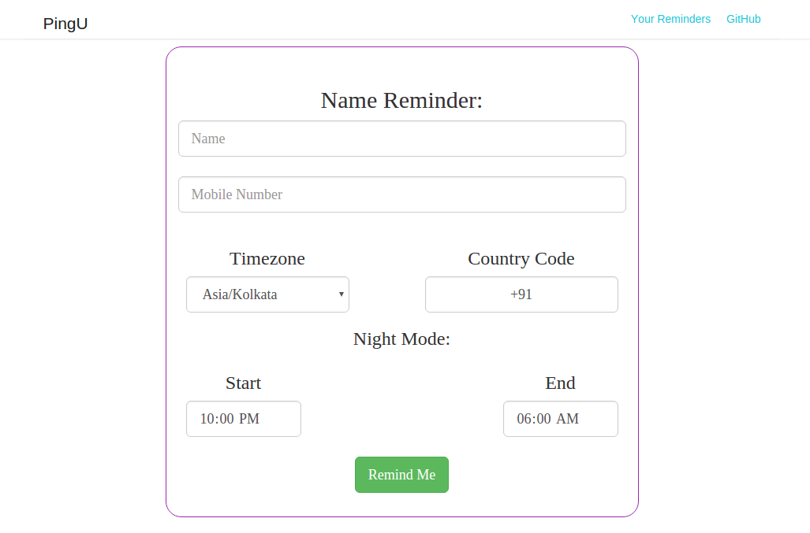
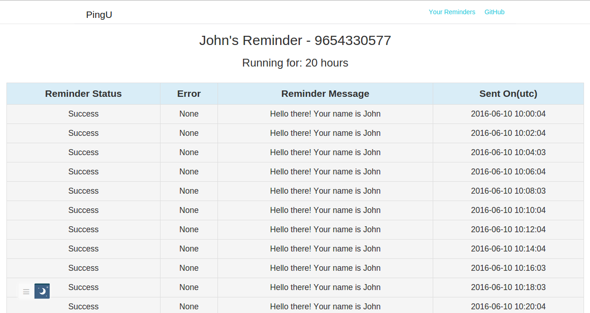
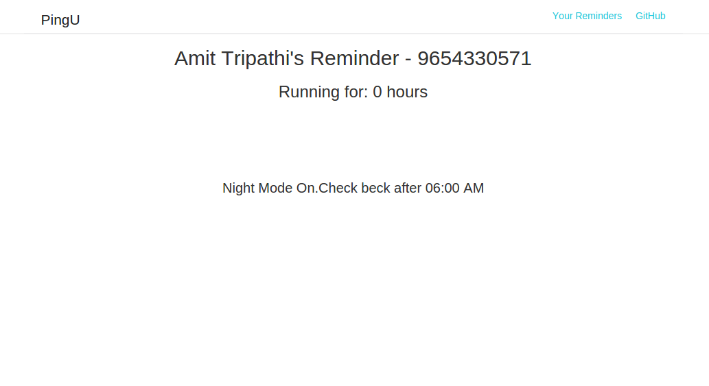

======
PingU
======

Requirements
=============

* Python 2.7

* pip

* Mysql

* Platform: Linux

import os
saved_stdout = sys.stdout
sys.stdout  = StringIO()
os.system('which python')
testout = sys.stdout.getvalue()
sys.stdout.close()
sys.stdout = saved_stdout
print testout

How to run?
============

while you are in the root directory of project run
    
    sudo sh setup.sh

OR

* pip install -r requirements.txt

* mysql -u root -p 

* Enter mysql password when prompted.

* Create DB by "CREATE DATABASE msgapp;"

* runt "python app.py"

Architecture:
===============

Technology:
============

Language: Python

Framework: Flask, Bootstrap

Template Engine: Jinja2

ORM: SqlAlchemy

Cron
=====

The app uses linux inbuilt crontab for setting up cron job. For setting up crons within Python code python-crontab module is used.

Database:
==========

Tables: users, reminders

Users table

    id (Primary Key, auto_increment)
    name
    phone (unique)
    country_code
    timezone
    night_start
    night_end
    created_on
    updated_on

Reminders table

    id (Primary Key, auto_increment)
    phone( Forein key reference users.phone)
    reminder_status
    error
    reminder_message
    created_on
    updated_on

Code Structure:
================

    ├── app.py

    ├── __init__.py

    ├── msgapp

    │   ├── cron.py

    │   ├── __init__.py

    │   ├── messenger.py

    │   ├── models

    │   │   ├── __init__.py

    │   │   ├── user.py

    │   ├── utils.py

    │   ├── views.py

    |

    ├── settings.py

    ├── setup.sh

    ├── templates

        ├── base.html

        └── msgapp

            ├── index.html

            ├── info.html

            └── reminder_info.html

Challenege:
============

1. Create a (basic) web based application where John can set his phone number: `Screenshot <screenshots/chall1.png>`_

2. Send an SMS every one hour except at night: `Screenshot(sent at every 2 minutes) <screenshots/chall2.png>`_

3. Try resending an SMS if it fails, but retry no more than 5 times. `Retry source code <https://github.com/amitt001/PingU/blob/master/msgapp/messenger.py#L25>`_

4. The web application should also log all the failed messages and tell John for how many hours the application has been running. `Screenshot2 <screenshots/chall2.png>`_

Do not send message during night: `Source Code <https://github.com/amitt001/PingU/blob/master/msgapp/messenger.py#L42>`_ , `Nightmode <screenshots/nightmode.png>`_

